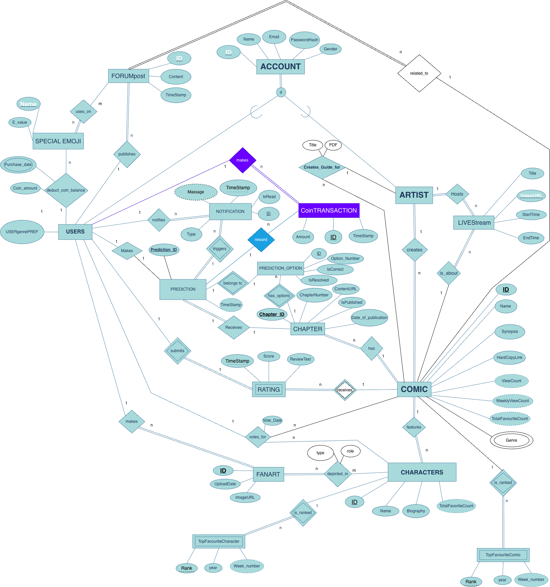
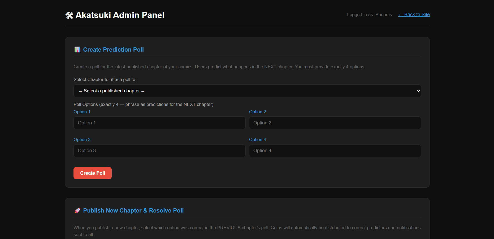
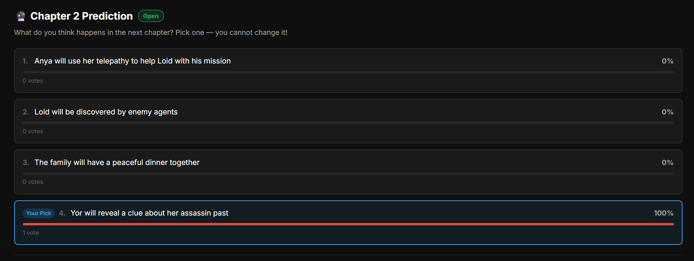
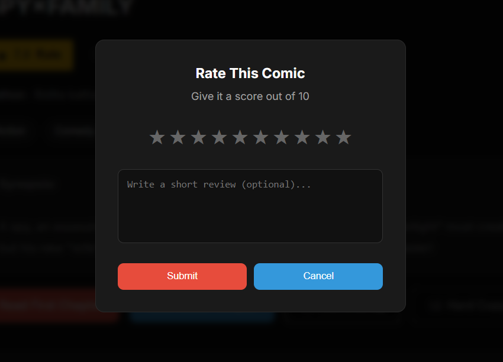
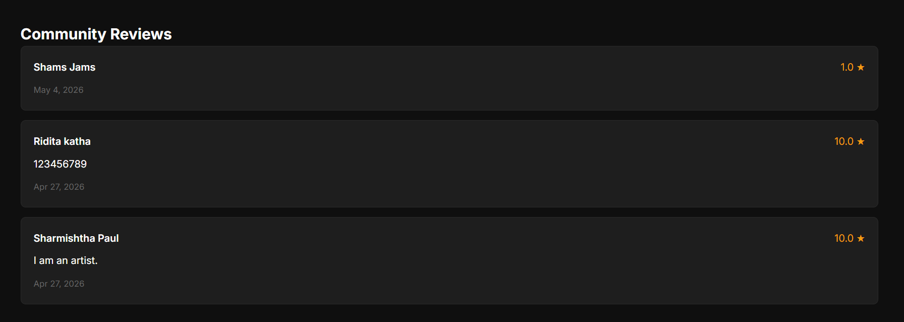
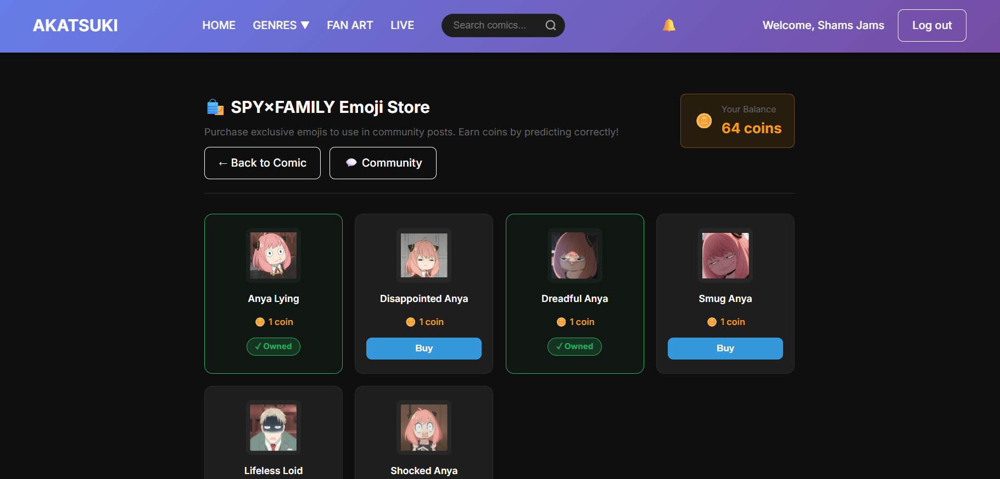
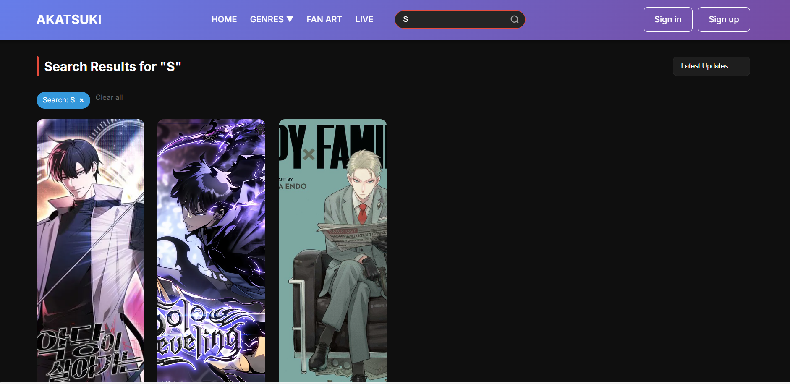
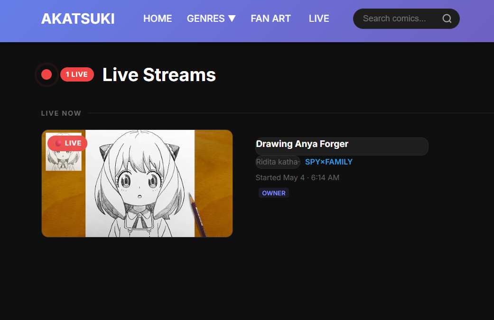
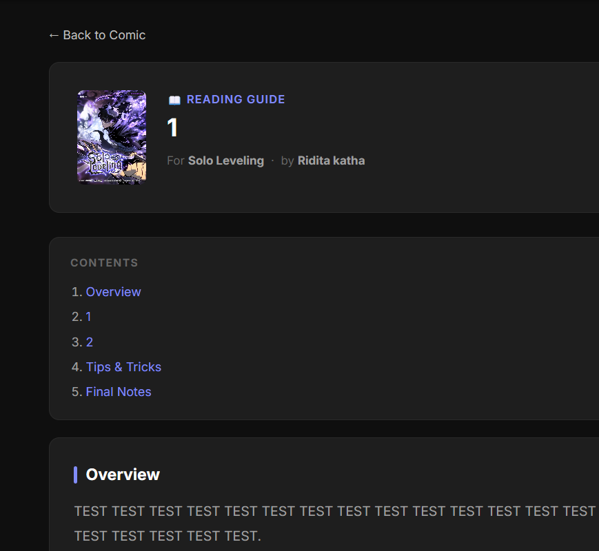
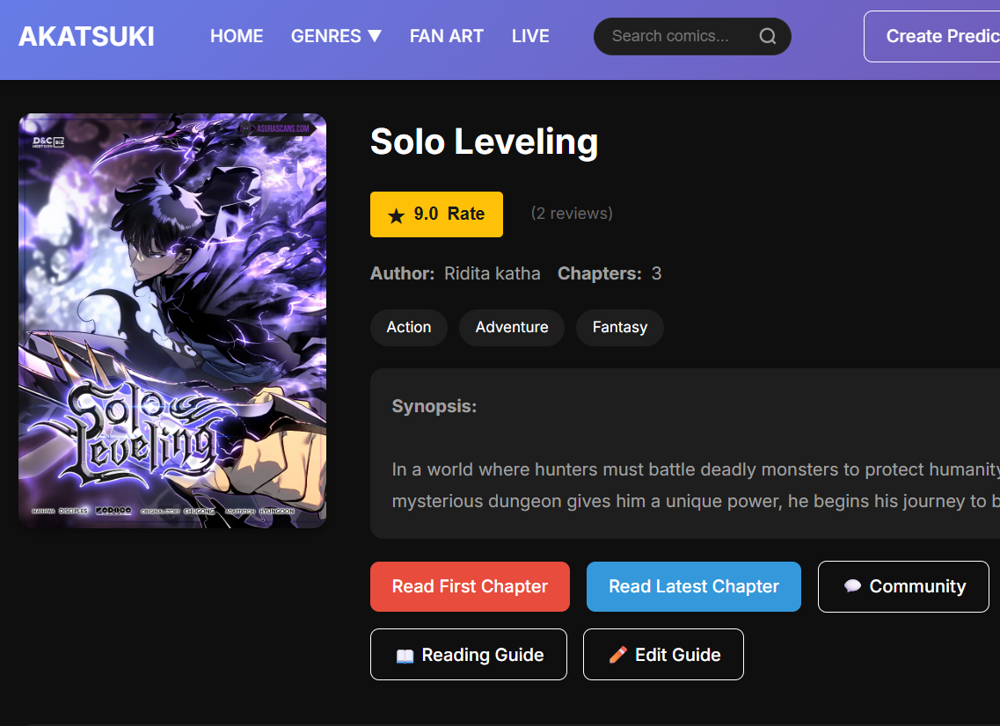

# Akatsuki — Comic Management System

A database-driven web platform that connects comic artists and readers. Readers browse and read comics, rate and review them, predict upcoming plot points to earn coins, spend coins on comic-specific emojis, join community forums, upload fan art and watch artists stream live. Artists publish comics and chapters, run prediction polls, host live streams and write reading guides.

Built as the project for **CSE370: Database Systems**.

**Tech stack:** PHP 8 · MySQL / MariaDB · HTML5 · CSS3 · JavaScript · XAMPP

---

## Features

**Readers**
- Browse, search, filter by genre and sort comics; read chapters page by page
- Rate (1–10) and review comics; edit your own review
- Predict the next chapter from a 4-option poll — correct predictions earn coins
- Spend coins in each comic's emoji store and use the emojis in community posts
- Per-comic community forum
- Notifications for predictions, results and new chapters
- Vote for favourite characters; weekly Top 5 comics and character leaderboard
- Recommendations based on the reader's preferred genre
- Fan art gallery with upload and character filter
- Links to buy the printed hard copy

**Artists**
- Dashboard to create comics, upload chapters, add characters and manage emojis
- Create prediction polls; publish the next chapter and resolve the poll (coins and notifications are sent automatically)
- Go live, schedule streams and end streams (YouTube links)
- Create and edit a reading guide for each comic

---

## Screenshots

### Database design
| ER / EER diagram | Schema diagram |
|---|---|
|  |  |

### Admin panel & prediction polls
| Create prediction poll | Publish chapter & resolve poll | Emoji store management |
|---|---|---|
|  |  |  |

### Comic details, predictions & ratings
| Chapters & actions | Prediction poll |
|---|---|
|  |  |
| **Rate this comic** | **Community reviews** |
|  |  |

### Emoji store & notifications
| Emoji store | Notifications |
|---|---|
|  |  |

### Browse, filter & search
| Genre menu | Search results | Sort options |
|---|---|---|
|  |  |  |

### Live streams
| Live now | Past streams | Live & past |
|---|---|---|
|  |  |  |
| **Go Live modal** | **Go Live dashboard** | **Go Live on comic page** |
|  |  |  |

### Community forum
| Forum page | Posts | Discussion preview |
|---|---|---|
|  |  |  |

### Reading guide
| Guide button | Guide view | Guide editor | Edit guide |
|---|---|---|---|
|  |  |  |  |

---

## Database

Database name: `Anya_Forger` — 21 tables, created by [`setup_database.sql`](setup_database.sql).

| Area | Tables |
|---|---|
| Accounts | `USERS`, `ARTIST` |
| Comics | `COMIC`, `GENRE`, `CHAPTER`, `CHARACTERS` |
| Reviews | `RATING` |
| Predictions & coins | `PREDICTION_OPTION`, `PREDICTION`, `COIN_TRANSACTION`, `NOTIFICATION` |
| Community & emojis | `FORUM_POST`, `SPECIAL_EMOJI`, `USER_EMOJI`, `USES_ON` |
| Fan art | `FANART`, `DEPICTED_IN` |
| Live streams | `LIVESTREAM` |
| Rankings | `VOTE_FOR`, `TOP_FAVOURITE_COMIC`, `TOP_FAVOURITE_CHARACTER` |

Coin balances, average ratings and favourite counts are derived with `SUM`, `AVG` and `COUNT` rather than stored. The schema is in 3NF.

---

## Getting started

1. Install [XAMPP](https://www.apachefriends.org) (PHP 8.0+) and start **Apache** and **MySQL**.
2. Place the project in `C:\xampp\htdocs\akatsuki`.
3. Open http://localhost/phpmyadmin → **Import** → select `setup_database.sql` → **Import**.
   This creates the `Anya_Forger` database with sample data. Skip this step if the database already exists — the script replaces it.
4. Visit http://localhost/akatsuki/

Database credentials are set in [`db.php`](db.php) (default: `root` with no password).

Sample accounts (password `password`):

| Role | Email |
|---|---|
| Reader | `user@example.com` |
| Artist | `artist@example.com` |

Images (covers, chapter pages, emojis, fan art, guides) are stored under `assets/`, which is created automatically when content is uploaded and is not part of this repository.

---

## Project structure

```
├── db.php, functions.php        Database connection and shared helpers
├── header.php, footer.php       Layout
├── style.css, script.js         Styling and client-side behaviour
├── index.php, comics.php        Home, browse / search
├── comic.php, reader.php        Comic details, chapter reader
├── community.php                Forum
├── emoji_store.php              Emoji store (+ emoji_purchase.php)
├── prediction_submit.php        Prediction endpoint
├── notifications.php, profile.php
├── top-comics.php, fan-art.php, livestream.php
├── admin_panel.php              Artist dashboard (+ get_poll_options.php)
├── artist_go_live.php           Live stream management
├── create_guide.php, view_guide.php
├── login_*.php, register_*.php, logout.php
├── setup_database.sql           Schema and sample data
├── docs/                        ER and schema diagrams
└── screenshots/
```

---

## License

Copyright © 2026. All rights reserved. This project may not be copied, modified, distributed or used without prior written permission. See [LICENSE](LICENSE).
