<p align="center">
  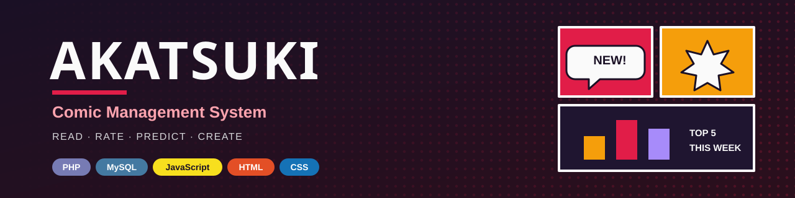
</p>

<p align="center">
  
  
  
  
  
  
  
</p>

<p align="center">
  A database-driven web platform that connects <b>comic artists</b> and <b>readers</b> —
  read, rate, predict the next chapter, earn coins, join communities and watch artists stream live.<br>
  Built for <b>CSE370: Database Systems</b>.
</p>

<p align="center">
  <a href="#-overview">Overview</a> •
  <a href="#-features">Features</a> •
  <a href="#-screenshots">Screenshots</a> •
  <a href="#-database-design">Database</a> •
  <a href="#-project-structure">Structure</a>
</p>

> [!IMPORTANT]
> **Portfolio showcase.** This repository presents the design and implementation of Akatsuki for portfolio and academic review only. It is not intended for installation, deployment or reuse, so setup instructions are intentionally omitted. The source code is shared for viewing purposes only. See the [License](#-license) for full terms.

---

## 🧭 Overview

**Akatsuki** is a full-stack comic platform with two kinds of accounts:

| Role | What they do |
|------|--------------|
| 📖 **Readers** | Browse and read comics, rate and review them, predict upcoming plot points to earn coins, spend coins on comic-specific emojis, join community forums, upload fan art and watch live streams |
| 🎨 **Artists** | Publish comics and chapters, run prediction polls, host live streams, manage emoji stores and write reading guides |

At its core is a **21-table relational database** in third normal form, which drives everything from coin balances to weekly leaderboards.

---

## ✨ Features

### 📖 For readers
- **Browse & discover:** search, filter by genre and sort comics; get recommendations based on your preferred genre
- **Read:** chapter reader with page-by-page navigation
- **Rate & review:** score comics from 1–10 and write, edit or update your own review
- **Predict the next chapter:** answer a 4-option poll; correct predictions earn **coins**
- **Emoji store:** spend coins on comic-specific emojis and use them in community posts
- **Community forum:** a dedicated discussion space for every comic
- **Notifications:** for predictions, results and new chapters
- **Rankings:** vote for favourite characters; weekly **Top 5 comics** and character leaderboard
- **Fan art gallery:** upload fan art and filter by character
- **Hard copies:** links to buy printed editions

### 🎨 For artists
- **Dashboard:** create comics, upload chapters, add characters and manage emojis
- **Prediction polls:** create polls, then publish the next chapter and resolve the poll — coins and notifications are sent automatically
- **Live streaming:** go live, schedule streams and end them (YouTube links)
- **Reading guides:** create and edit a guide for each comic

### 🔒 Under the hood
- **Prepared statements** (PDO) for every database query, protecting against SQL injection
- **Hashed passwords** with `password_hash` / `password_verify`
- **Output escaping** on user-generated content to prevent XSS
- **Session regeneration** on login
- **Role-based access**: reader-only and artist-only pages are enforced on the server
- **Derived values**: coin balances, average ratings and favourite counts are calculated with `SUM`, `AVG` and `COUNT` instead of being stored, so they can never go out of sync

---

## 📸 Screenshots

### Admin panel & prediction polls
| Create prediction poll | Publish chapter & resolve poll | Emoji store management |
|:---:|:---:|:---:|
|  | 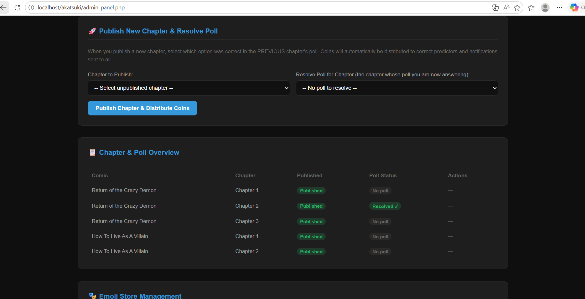 | 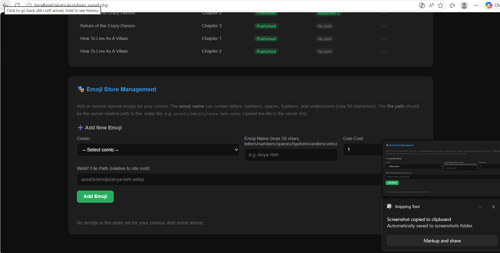 |

### Comic details, predictions & ratings
| Chapters & actions | Prediction poll |
|:---:|:---:|
| 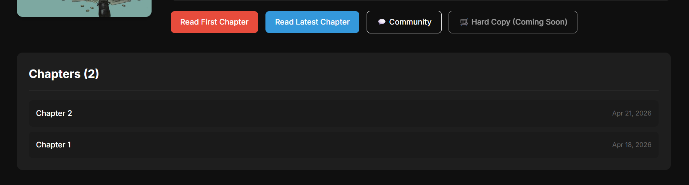 |  |
| **Rate this comic** | **Community reviews** |
|  |  |

### Emoji store & notifications
| Emoji store | Notifications |
|:---:|:---:|
|  | 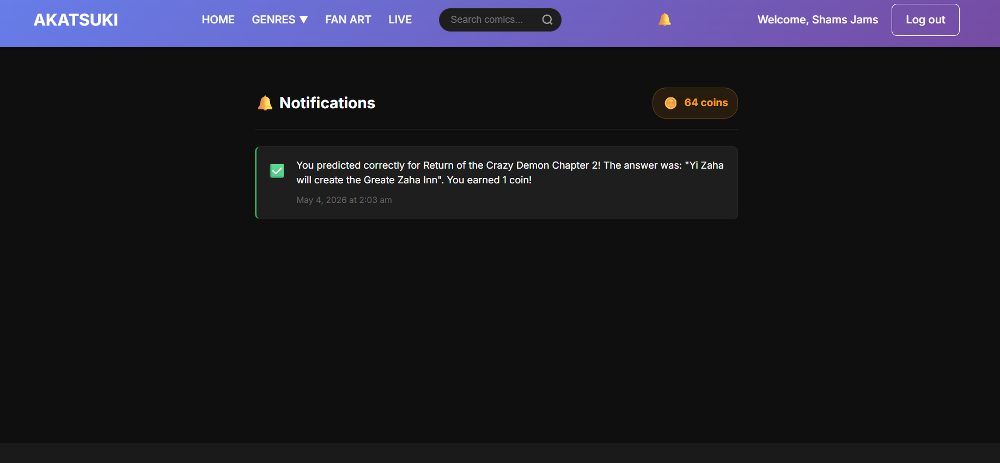 |

<details>
<summary><b>Browse, filter & search</b></summary>
<br>

| Genre menu | Search results | Sort options |
|:---:|:---:|:---:|
| 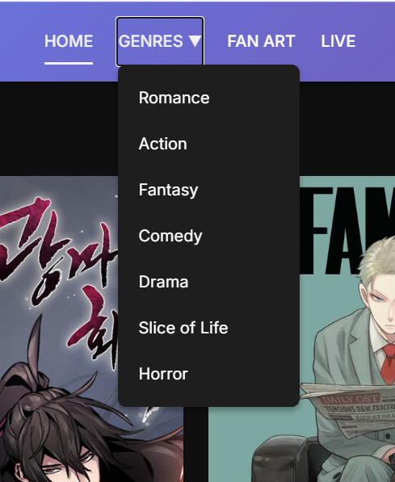 |  | 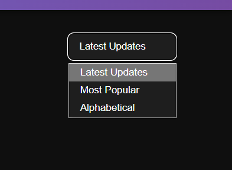 |
</details>

<details>
<summary><b>Live streams</b></summary>
<br>

| Live now | Past streams | Live & past |
|:---:|:---:|:---:|
|  | 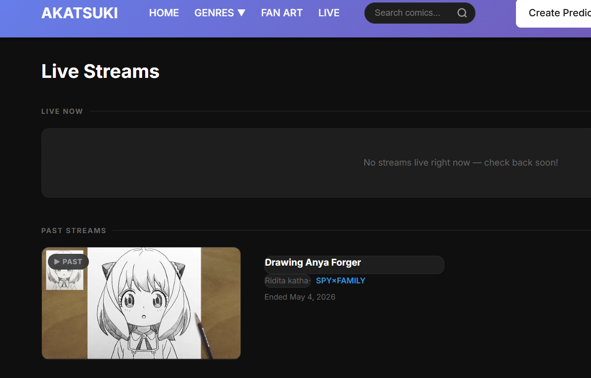 | 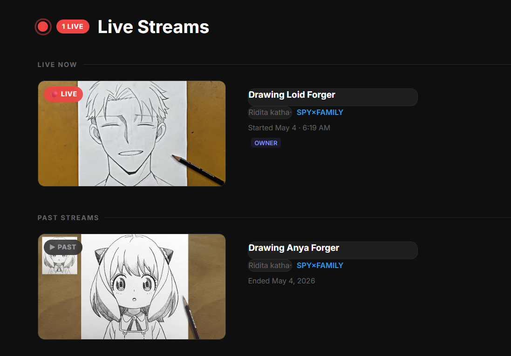 |
| **Go Live modal** | **Go Live dashboard** | **Go Live on comic page** |
| 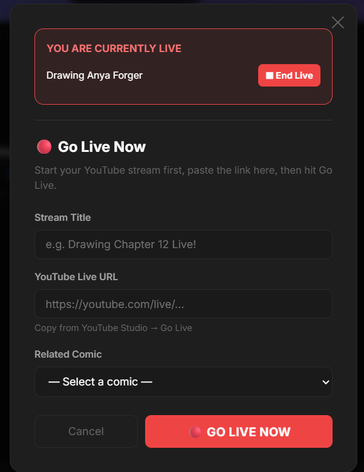 | 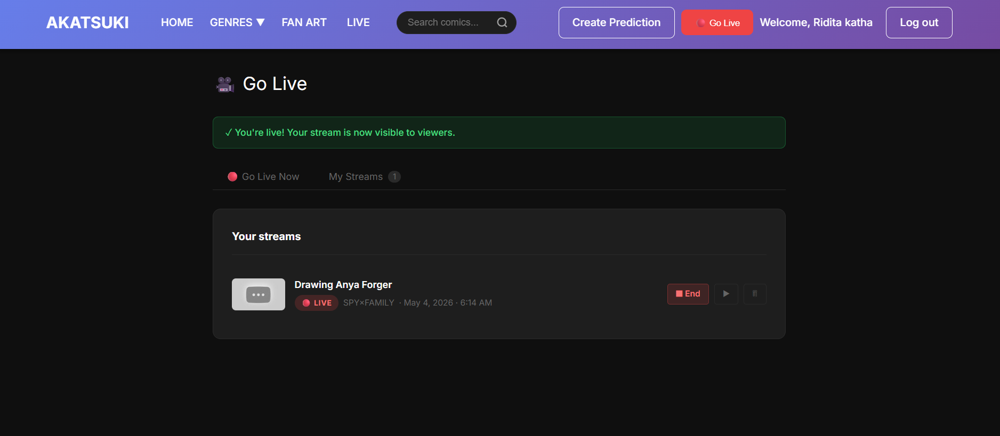 | 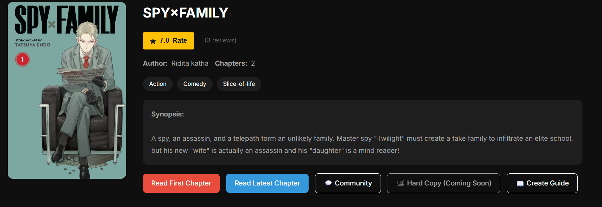 |
</details>

<details>
<summary><b>Community forum</b></summary>
<br>

| Forum page | Posts | Discussion preview |
|:---:|:---:|:---:|
| 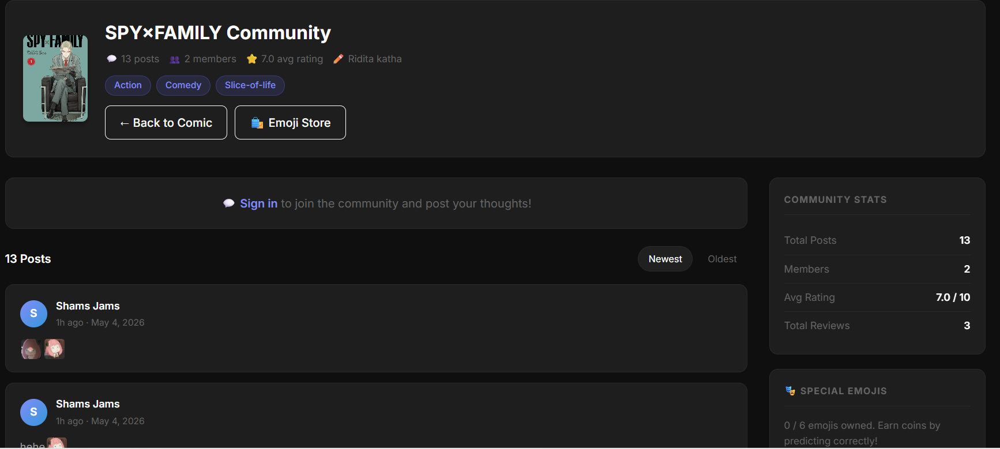 | 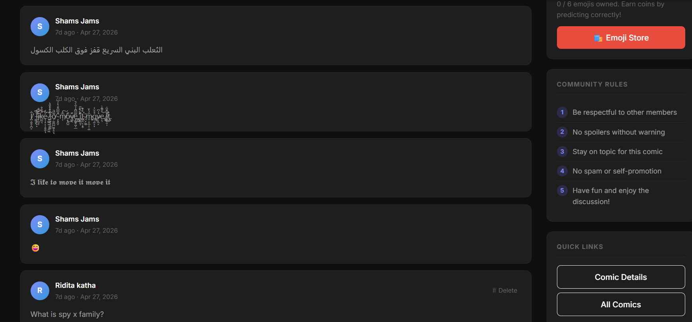 | 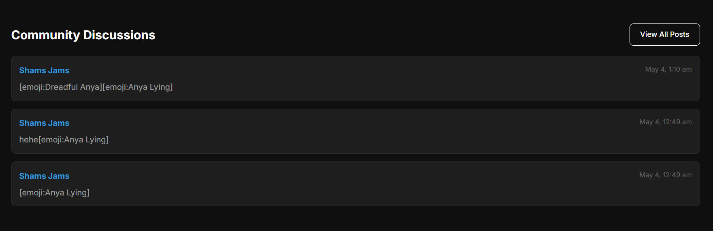 |
</details>

<details>
<summary><b>Reading guide</b></summary>
<br>

| Guide button | Guide view | Guide editor | Edit guide |
|:---:|:---:|:---:|:---:|
|  |  | 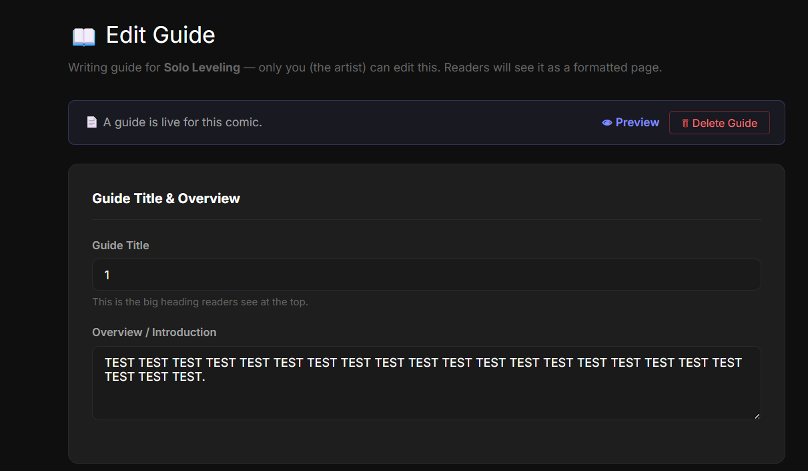 |  |
</details>

---

## 🗄️ Database Design

Database **`Anya_Forger`** — **21 tables** in **3NF**, with **30 foreign-key relationships**, created by [`database/setup_database.sql`](database/setup_database.sql) along with sample data.

| ER / EER diagram | Relational schema |
|:---:|:---:|
|  | 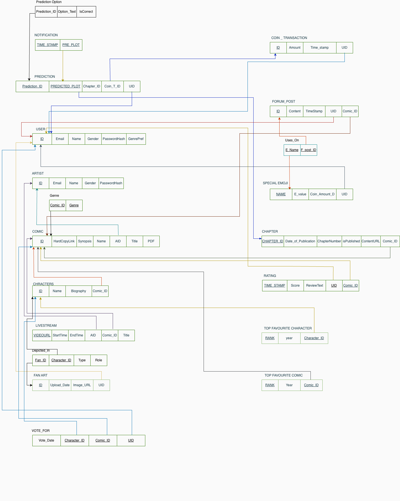 |

| Area | Tables |
|------|--------|
| Accounts | `USERS`, `ARTIST` |
| Comics | `COMIC`, `GENRE`, `CHAPTER`, `CHARACTERS` |
| Reviews | `RATING` |
| Predictions & coins | `PREDICTION_OPTION`, `PREDICTION`, `COIN_TRANSACTION`, `NOTIFICATION` |
| Community & emojis | `FORUM_POST`, `SPECIAL_EMOJI`, `USER_EMOJI`, `USES_ON` |
| Fan art | `FANART`, `DEPICTED_IN` |
| Live streams | `LIVESTREAM` |
| Rankings | `VOTE_FOR`, `TOP_FAVOURITE_COMIC`, `TOP_FAVOURITE_CHARACTER` |

**Design decisions**
- **Normalised to 3NF** to remove redundancy and update anomalies.
- **No stored totals**: coin balances come from `SUM` over `COIN_TRANSACTION`, ratings from `AVG` over `RATING`, and favourites from `COUNT` over `VOTE_FOR`.
- **Referential integrity** enforced with foreign keys and `ON DELETE CASCADE`, so removing a comic cleanly removes its chapters, polls, posts and emojis.
- **Many-to-many relationships** (fan art ↔ characters, emojis ↔ posts, users ↔ character votes) are modelled with dedicated junction tables.

---

## 🗂️ Project Structure

```text
Akatsuki-comic-management-system/
├── src/                          # the web application
│   ├── db.php                    # database connection & session
│   ├── functions.php             # shared helpers (auth, coins, rendering)
│   ├── header.php, footer.php    # page layout
│   ├── style.css, script.js      # styling and client-side behaviour
│   │
│   ├── index.php                 # home page
│   ├── comics.php                # browse, search, filter, sort
│   ├── comic.php                 # comic details, ratings, predictions
│   ├── reader.php                # chapter reader
│   ├── community.php             # per-comic forum
│   ├── emoji_store.php           # emoji store  (+ emoji_purchase.php)
│   ├── prediction_submit.php     # prediction endpoint
│   ├── notifications.php, profile.php
│   ├── top-comics.php            # weekly rankings
│   ├── fan-art.php               # fan art gallery
│   ├── livestream.php            # live & past streams
│   │
│   ├── admin_panel.php           # artist dashboard  (+ get_poll_options.php)
│   ├── artist_go_live.php        # live stream management
│   ├── create_guide.php, view_guide.php
│   └── login_*.php, register_*.php, logout.php
│
├── database/
│   └── setup_database.sql        # schema + sample data
│
├── docs/
│   ├── banner.svg
│   ├── diagrams/                 # ER/EER and relational schema diagrams
│   └── screenshots/              # 25 application screenshots
│
├── LICENSE
└── README.md
```

---

## 🛠️ Tech Stack

| Layer | Technology |
|-------|------------|
| **Backend** | PHP 8 with PDO |
| **Database** | MySQL / MariaDB |
| **Frontend** | HTML5 · CSS3 · vanilla JavaScript |
| **Development environment** | XAMPP (Apache + MySQL) |
| **Design** | ER/EER modelling · relational schema · 3NF normalisation |

---

## 📄 License

Copyright © 2026. **All rights reserved.**

This project may not be copied, modified, distributed, or submitted as anyone else's work without prior written permission. See [LICENSE](LICENSE) for details.
